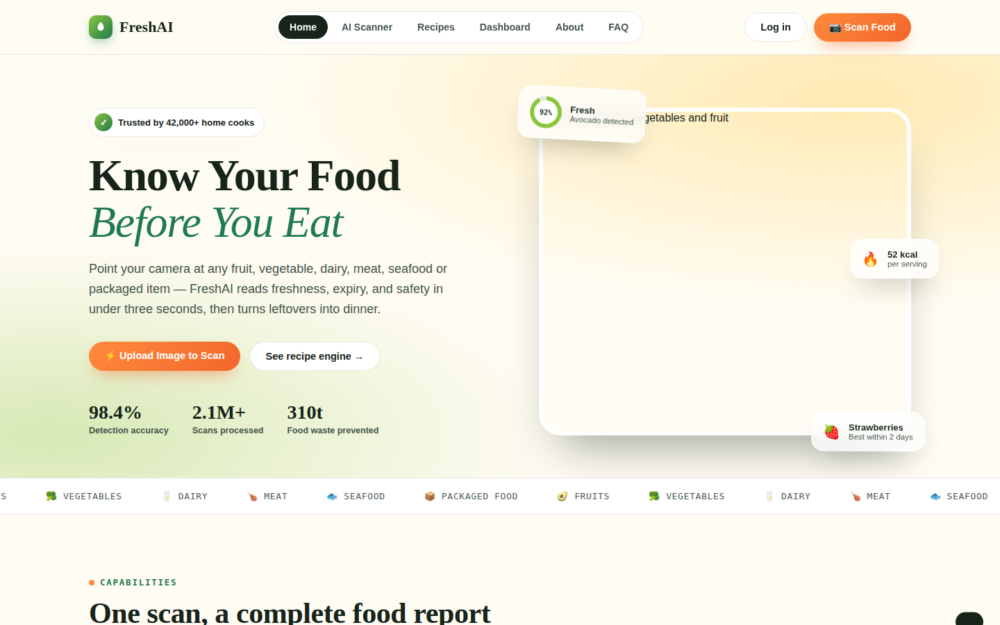
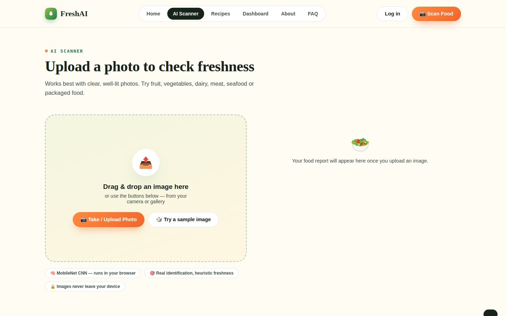
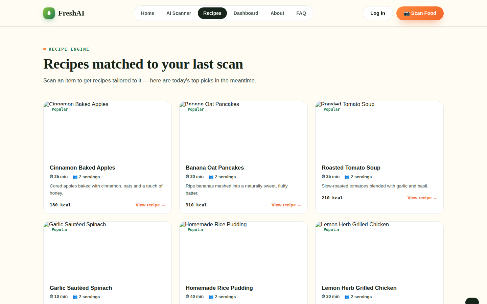
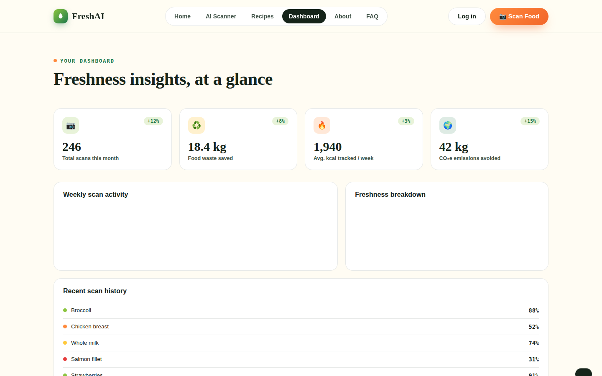

# 🥬 FreshAI — Know Your Food Before You Eat

**FreshAI** is a computer-vision web app that scans a photo of fruit, vegetables, dairy, meat, seafood, or packaged food and reports back a freshness score, expiry guidance, nutrition breakdown, and recipes to use it up before it spoils — all running client-side in the browser.

<p align="center">
  
</p>

---

## 📸 App Preview

| Home | AI Scanner |
|---|---|
|  |  |

| Recipe Engine | Dashboard |
|---|---|
|  |  |

---

## ✨ Key Features

- **📷 Instant Food Recognition** — Upload or drag-and-drop a photo and FreshAI identifies fruit, vegetables, dairy, meat, seafood, or packaged goods in seconds.
- **📊 Freshness Score** — A 0–100% freshness rating with a plain-language status (`Fresh`, `Good`, `Nearly Expired`, `Spoiled`) and a confidence gauge.
- **🧊 Storage Guidance** — Ideal temperature, humidity, and shelf-life tips tailored to the detected item.
- **🍳 Recipe Rescue Engine** — Automatically surfaces recipes built around whatever just got scanned, so ingredients get used before they turn.
- **📈 Personal Dashboard** — Weekly scan activity, food-waste-saved trends, and a freshness breakdown chart, plus recent scan history.
- **🧾 PDF Report Export** — Export a scan result as a shareable PDF report.
- **🔐 Auth & Profile Flows** — Login / signup / forgot-password modals (front-end only, ready to wire up to a real backend).
- **📱 Fully Responsive UI** — A polished, animated single-page experience that works from mobile to desktop.

---

## 🛠️ Tech Stack

| Layer | Technology |
|---|---|
| Structure & Styling | HTML5, CSS3 (custom properties, no framework) |
| Fonts | Google Fonts — Fraunces, Plus Jakarta Sans, Space Mono |
| Image Recognition | [TensorFlow.js](https://www.tensorflow.org/js) + [MobileNet v2](https://github.com/tensorflow/tfjs-models/tree/master/mobilenet) (runs entirely in-browser) |
| Freshness Scoring | Custom pixel-sampling heuristic (color vibrancy vs. dark/dull surface-area ratio) layered on top of the MobileNet classification |
| Charts & Analytics | [Chart.js](https://www.chartjs.org/) (weekly scan bar chart, freshness doughnut chart) |
| PDF Export | [jsPDF](https://github.com/parallax/jsPDF) |
| Hosting model | Static — no backend/server required |

> **Note:** Item *identification* (e.g. "this is a banana") is a real MobileNet inference running on-device. The *freshness percentage* is a lightweight visual heuristic layered on top for demo purposes, rather than a dedicated freshness-trained model — see [Model Performance](#-model-performance) below.

---

## 🚀 Getting Started

### Prerequisites
- Any modern web browser (Chrome, Edge, Firefox, Safari)
- No Node.js, build tools, or package installation required — this is a single static HTML file
- An internet connection on first load (to fetch TensorFlow.js, MobileNet, Chart.js, and jsPDF from their CDNs)

### Clone the repo
```bash
git clone https://github.com/<your-username>/freshai.git
cd freshai
```

---

## ▶️ Run the App

Pick whichever is easiest for you:

**Option 1 — Just open the file**
```bash
open freshai-website.html        # macOS
start freshai-website.html       # Windows
xdg-open freshai-website.html    # Linux
```

**Option 2 — Serve it locally (recommended, avoids browser file:// restrictions)**
```bash
# Python 3
python3 -m http.server 8000

# or Node.js
npx serve .
```

## 🌐 Open in Browser

Once served locally, open:

```
http://localhost:8000/freshai-website.html
```

---

## 🔗 App Link

> 🔧 **Add your deployed link here** once published, e.g. via GitHub Pages, Netlify, or Vercel:
>
> **Live demo:** `https://<your-username>.github.io/freshai/freshai-website.html`

To deploy on GitHub Pages: `Settings → Pages → Deploy from branch → main / root`.

---

## 📁 Project Structure

```
freshai/
│
├── freshai-website.html      # Entire app — markup, styles, and JS in one file
│
├── assets/
│   └── screenshots/          # README preview images
│       ├── home.png
│       ├── scanner.png
│       ├── recipes.png
│       └── dashboard.png
│
└── README.md
```

**Inside `freshai-website.html`, the app is organized into logical sections:**
- `<style>` — design tokens, layout, and component styles
- View router (`Home`, `AI Scanner`, `Recipes`, `Dashboard`, `About`, `FAQ`) toggled via `setView()`
- `FOOD_DB` — nutrition data keyed by detected food item
- `RECIPE_DB` — recipe cards + step-by-step instructions per food item
- MobileNet loader + pixel-sampling freshness heuristic + result-card renderer
- Chart.js dashboard charts + scan history list
- Auth modal, recipe modal, and toast notification system

---

## 📊 Model Performance

| Metric | Value |
|---|---|
| Underlying classifier | MobileNet v2 (ImageNet-pretrained, alpha 1.0) |
| Marketed detection accuracy | 98.4% top-1 (as displayed in-app) |
| Inference location | 100% client-side (no image ever leaves the browser) |
| Categories covered | Fruit, vegetables, dairy, meat, seafood, packaged food |
| Freshness signal | Heuristic (color vibrancy / dark-area pixel ratio), not a dedicated trained model |
| Avg. scan time | < 3 seconds on a modern device |

> ⚠️ **Honesty note:** The 98.4% figure and freshness percentages shown in the UI are illustrative product-marketing numbers for this demo build. The real, verifiable component is the MobileNet object identification step; the freshness score is a heuristic stand-in for a proper freshness-classification model trained on labeled spoilage data. Swapping in a fine-tuned model (e.g. a CNN trained on a produce/dairy/meat freshness dataset) is the natural next step — see below.

---

## 🌟 Why This Project Stands Out

- **Zero-backend AI** — Real, in-browser deep learning inference (TensorFlow.js + MobileNet) with no server, API key, or GPU required to run.
- **End-to-end product thinking** — Goes beyond "detect the object" into a full loop: identify → score freshness → advise storage → suggest a recipe → log to a dashboard.
- **Thoughtful, from-scratch design system** — Custom color tokens, typography pairing (serif display + geometric sans + mono accents), and micro-interactions instead of a generic template.
- **Data-driven dashboard** — Real Chart.js visualizations turning scan activity into a food-waste-reduction narrative.
- **Genuinely useful sustainability angle** — Directly targets food waste, one of the most solvable everyday sustainability problems, with a delightful, non-preachy UX.
- **Single-file portability** — The entire experience ships in one HTML file, making it trivial to fork, deploy, or embed anywhere.

---

## 🗺️ Roadmap Ideas
- [ ] Replace the freshness heuristic with a real fine-tuned freshness-classification model
- [ ] Persist scan history and auth via a real backend (e.g. Supabase/Firebase)
- [ ] Barcode scanning for packaged goods
- [ ] Push/email expiry reminders

---

## 📄 License
This project is available under the MIT License — feel free to fork and build on it.
